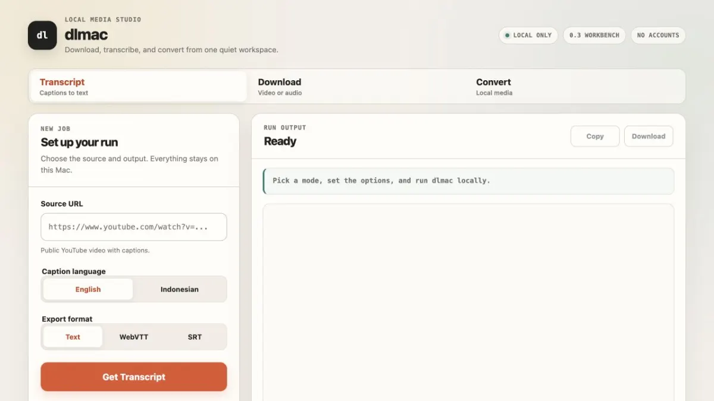

# dlmac

macOS CLI wrapper for [yt-dlp](https://github.com/yt-dlp/yt-dlp) and
[ffmpeg](https://ffmpeg.org). Download online media, convert local media, and
save public YouTube transcripts.



## Requirements

- macOS
- [Homebrew](https://brew.sh)
- yt-dlp
- ffmpeg
- webp (provides the `cwebp` and `gif2webp` encoders)
- Go 1.26 or newer to build the optional local web interface

## Installation

```bash
git clone https://github.com/srmdn/dlmac.git
cd dlmac
./install.sh
```

`install.sh` checks dependencies, offers to install missing ones via Homebrew,
and builds the `dlmac-web` helper next to the CLI.

To run `dlmac` from any directory, add the project directory to your `PATH` or
copy both `dlmac` and `dlmac-web` to a directory that is already in your
`PATH`, such as `~/.local/bin`.

The compiled web helper does not require Go or the project source tree at
runtime. Keep `dlmac` and `dlmac-web` in the same directory.

## Usage

```
dlmac info <url>                    Show video metadata
dlmac formats <url>                 Show available formats
dlmac video <url>                   Download best video (mp4)
dlmac video <url> --quality 360p    Download best video up to 360p
dlmac video <url> --quality 480p    Download best video up to 480p
dlmac video <url> --quality 720p    Download best video up to 720p
dlmac video <url> --quality 1080p   Download best video up to 1080p
dlmac audio <url>                   Download best audio (mp3)
dlmac audio <url> --format mp3      Download audio as mp3
dlmac audio <url> --format m4a      Download audio as m4a
dlmac audio <url> --format wav      Download audio as wav
dlmac transcript <url>              Download transcript as txt (English)
dlmac transcript <url> --lang id    Download Indonesian transcript
dlmac transcript <url> --lang en    Download English transcript
dlmac transcript <url> --format txt Download transcript as plain text
dlmac transcript <url> --format vtt Download transcript as WebVTT
dlmac transcript <url> --format srt Download transcript as SRT
dlmac serve                          Start localhost web UI
dlmac ui                             Alias for serve
dlmac convert <file> --to <format>   Convert local video, audio, or image media
```

All downloads saved to `./downloads/`.

## Examples

```bash
# Get video info
./dlmac info "https://example.com/video"

# Download video at 720p
./dlmac video "https://example.com/video" --quality 720p

# Download audio as mp3
./dlmac audio "https://example.com/video" --format mp3

# Download Indonesian transcript as plain text
./dlmac transcript "https://example.com/video" --lang id

# Run globally if dlmac is installed in PATH
dlmac transcript "https://example.com/video" --lang en --format txt

# Start the local web interface
./dlmac serve

# Convert a local video to a QuickTime-compatible MP4
./dlmac convert myvideo.webm --to mp4

# Extract audio from a local video
./dlmac convert myvideo.mp4 --to mp3

# Convert a local image
./dlmac convert artwork.png --to tiff

# Convert a local image to WebP
./dlmac convert artwork.png --to webp

# Convert a local audio file
./dlmac convert recording.wav --to flac
```

### Local conversion

`dlmac convert <file> --to <format>` accepts one local media file and saves the
result in `./downloads/` without overwriting an existing file. Supported target
formats are:

- Video: `mp4`, `webm`, `mkv`, and `mov`.
- Audio: `mp3`, `m4a`, `wav`, `flac`, `ogg`, and `opus`.
- Images: `jpg`, `png`, `gif`, `tiff`, and `webp`.

Video targets re-encode when needed. The `mkv` target can preserve compatible
streams without re-encoding. Audio targets remove the video stream, and image
targets export the first video frame when the input contains video.

The local web workbench provides a native macOS file picker. It sends only the
selected path to the localhost server; it does not upload the media file to a
remote service.

WebP output uses the official `cwebp` encoder from the Homebrew `webp`
package. Animated GIF input uses the companion `gif2webp` encoder. The local
web workbench shows the WebP target only when those tools are available.

## Compatibility

**Video downloads produce H.264 video with AAC audio in an MP4 container.**
This is the format QuickTime, Safari, and Apple's media framework expect.

If the source offers H.264+AAC natively, dlmac downloads it directly with
zero re-encoding — fast and lossless. If H.264+AAC is unavailable, dlmac
automatically re-encodes the output with ffmpeg.

Players like VLC, IINA, and mpv can play any codec combination. The H.264+AAC
preference only matters for QuickTime and Apple apps.

## Troubleshooting

**QuickTime can't open the file**
The output is already H.264+AAC and should work with QuickTime. If you
still have issues, check that ffmpeg is installed (`brew install ffmpeg`)
and that your yt-dlp is up to date (`brew upgrade yt-dlp`).

**No H.264 formats available**
Some videos (particularly at 1080p and above) only offer VP9/AV1 video.
dlmac falls back to whatever is available and re-encodes automatically.
You'll see a "Re-encoding to H.264+AAC" message during download.

**"Re-encoding to H.264+AAC" message appears**
This is normal when the source doesn't provide H.264+AAC natively.
The download will take longer because ffmpeg must re-encode the entire
video. The result is still a QuickTime-compatible MP4.

**"web helper not found" message appears**
Run `./install.sh` from the project checkout to build `dlmac-web`. If you copy
the CLI to another directory, copy `dlmac-web` with it.

**WebP output is unavailable**
Install the official WebP tools with `brew install webp`, then run
`./install.sh` again. The local web interface hides WebP when `cwebp` or
`gif2webp` is unavailable.

## Limitations

- macOS only
- No playlist support
- No interactive format selector in the CLI; the local web workbench provides
  a curated format selector
- No login/cookie support
- Transcript support depends on public captions or auto captions being
  available for the selected language
- Building the local web interface requires Go 1.26 or newer
- Quality depends on source video availability; falls back to best available
  below the requested resolution

## Legal & Ethical Notice

dlmac is a general-purpose media downloader built on yt-dlp. It does not
discriminate by platform — any URL yt-dlp supports will work. However, not
all platforms permit downloading.

**You are responsible for**:
- Ensuring you have the right to download the content
- Checking each platform's terms of service before downloading
- Respecting copyright, licensing, and applicable laws in your jurisdiction

**What dlmac does NOT do**:
- Bypass DRM, paywalls, or access restrictions
- Store or transmit login credentials (no cookie/auth support)
- Access private, unlisted, or members-only content
- Circumvent platform rate limits or anti-bot measures

**Platform policies vary.** Each platform has its own terms of service
regarding downloads. Check the relevant policies before downloading.
dlmac does not encourage violating any platform's policies — it simply
passes your URL to yt-dlp. The choice of what to download is yours, and
so is the responsibility.

If you are unsure whether downloading specific content is legal in your
country or permitted by the platform, consult a legal professional.

## License

GPL-3.0-or-later
